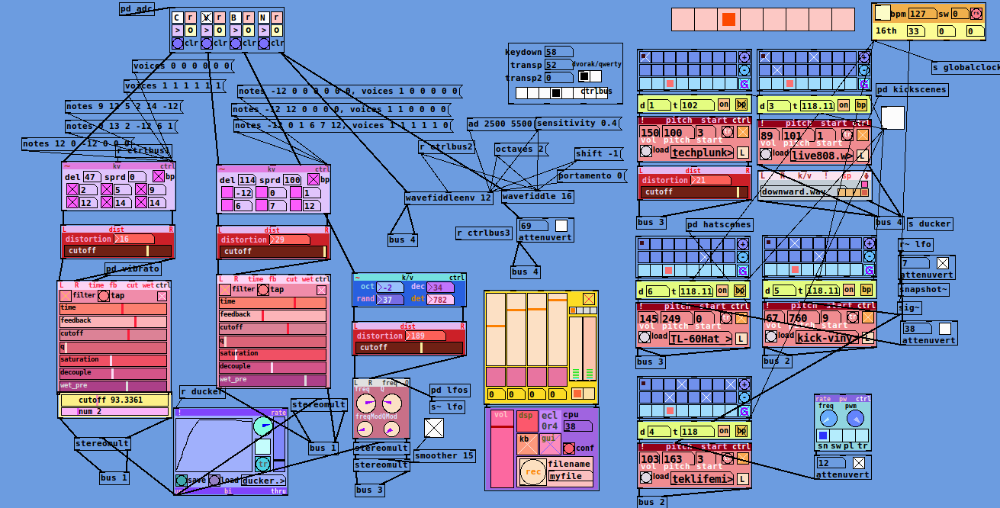

# ASTERISM v0.5 (formerly called ecl) 
modular synth environment for pd   

developed and tested on Pd Vanilla v0.48.0  
(in progress - migrating to Purr Data, should remain compatible with Vanilla) 

dependencies: moonlib, cyclone, zexy, iemguts, iemlib, pdlua, ggee 

## Installation Instructions

1. clone this repository or click "download as zip". 
2. Extract the folders adlib and eclobjects and add them to your pd path by opening pd, and going to Pd -> Preferences -> Path. Click "new" and select the adlib folder, and repeat for eclobjects.
3. Install dependencies if you don't have them already: Click Help -> Find Externals to open the Deken plugin manager and search for the libraries listed above. Find the appropriate version and install. 
4. You may have to manually add some of them to your path even after installing - zexy in particular can cause problems. 
5. If everything has gone right, you should be able to open a new patch and instantiate any object in the eclobjects folder. 

## Getting Started

1. Once everything is installed, you can make an empty patch and create a [eclbrowser] object. Press SHIFT-B or click on the toggle to open the browser; instantiate any object from within the browser and start making noise! 

## Objects and features

* ------ items with a > are up-to-date and should work well. Items without a > should probably work but haven't been updated in some time.

* native stereo - all audio objects are designed from the ground up as stereo. Practically this means that all kinds of modular weirdness can be applied to the stereo field as a parameter.
* state saving  - all objects will save their knob position and settings when you save the patch - no additional connections needed!
* external control (in progress) - most objects have a rightmost input labeled 'ctrl' that will allow you to address any of the panel controls with a message. For instance, [feedback 0.8( into the "ctrl" inlet of [delaypanel] will set the feedback slider to 0.8. This should allow relatively easy mapping to external controllers. 
* [oscpanel] - Simple oscillator with inputs for signal-controlled frequency, fold waveshaping, stereo detuning. Deliberately non-antialiased, extremely noisy.
* [oscblpanel] - same as above, but with 16x antialiasing. Much more processor intensive. 
* [303panel]> - everyone needs a 303. 
* [mixer4]> - 4 channel stereo mixer with pan and mute buttons. Mute buttons are hard-keyed to 1, 2, 3 and 4.
* [output]> - Stereo dac manager with dsp switch, cpu meter, and sound file recorder.
* [seq162]> - 16-step sequencer with 8 slots of sequence memory.  
* [cvseq8] - same as above, but outputs continuous numbers between -1 and 1. 
* [shaperpanel] - waveshaper with built in chebyshev polynomial generation
* [filterpanel]> - vcf based on [bob~]
* [envelope]> - create custom envelopes with modulatable speed. Many pre-made envelopes are available with the download. 
* [wavetablepanel] - 8 voice wavetable synth. Takes midi pitch/velocity pairs as input. Cpu intensive. 
* [lfopanel]> - multi-shape LFO with frequency and pulse width inputs.  
* [noteloop] - captures a loop of incoming midi note / velocity pairs and plays it back with variable tempo
* [delaypanel]> - recirculating delay with filters
* [rev3gui]> - gui for all parameters of Miller Puckette's [rev3~]
* [sampler]> - powerful sample playback unit. takes bangs or note/velocity pairs and converts them to pitch or slice playback. 
* [sampler3]> - simple bare-bones sampler, cheap and effective with modulatable pitch and start time
* [sampler4] - simple polyphonic sampler based on sampler3
* [pitchshifter2]> - 6 voice polyphonic real-time pitch shifter, controllable with MIDI messages, adjustable stereo spread
* [delaypanel]> - rich stereo delay with built-in filters
* [attenuvert]> - simple mono attenuverter for control signals, or anything really
* [wavefiddle2]> - pitch detector connected to a simple polyphonic synth. 
* [sawbasstracker]> pitch detector connected to a stereo saw oscillator and some interesting parameters
* [keyb]> - simple module that interprets key strokes as midi messages, modeled closely after the keyboard and controls in Live 9
* [plexermono]> four voice mono signal router with four built-in overdubbing loopers. Controls hard-keyed to C,V,B and N. 
* [clock] A reliable source of triggers for sequencers. Includes bpm and swing controls and three adjustable clock dividers.

## Notes

* you will need to configure [recorder] to point to where you want to store your sound files.

