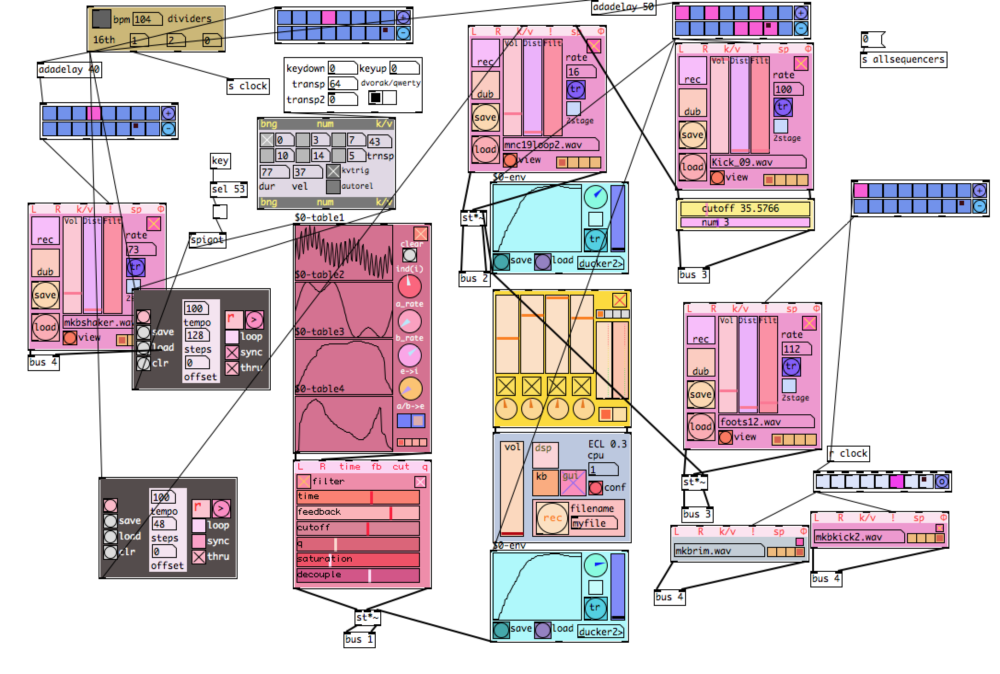

# eclipse [ECL] v0.2
modular synth environment for pd   

developed and tested on Pd Vanilla v0.47.1  

dependencies: moonlib, cyclone, zexy, iemguts, iemlib  

## Installation Instructions

1. clone this repository or click "download as zip". 
2. Extract the folders adlib and eclobjects and add them to your pd path by opening pd, and going to Pd -> Preferences -> Path. Click "new" and select the adlib folder, and repeat for eclobjects.
3. Install dependencies if you don't have them already: Click Help -> Find Externals to open the Deken plugin manager and search for the libraries listed above. Find the appropriate version and install. 
4. You may have to manually add some of them to your path even after installing - zexy in particular can cause problems. 
5. If everything has gone right, you should be able to open a new patch and instantiate any object in the eclobjects folder. 

## Objects and features

* native stereo - all audio objects are designed from the ground up as stereo. Practically this means that all kinds of modular weirdness can be applied to the stereo field as a parameter.
* state saving [in progress] - most objects will save their knob position and settings when you save the patch.
* [oscpanel] - Simple oscillator with inputs for signal-controlled frequency, fold waveshaping, stereo detuning. Deliberately non-antialiased, extremely noisy.
* [oscblpanel] - same as above, but with 16x antialiasing. Much more processor intensive. 
* [303panel] - everyone needs a 303. 
* [mixer4] - 4 channel stereo mixer with pan and mute buttons. Mute buttons are hard-keyed to a, o, e, u (sorry qwerty users - it's pretty easy to fix)
* [output] - Stereo dac manager with dsp switch, cpu meter, and sound file recorder.
* [seq8] - simple 8-step sequencer that takes bangs and outputs 0s or 1s. Has inputs for each step, making them great to chain together. Rightmost inlet resets the sequence to step 0. 
* [cvseq8] - same as above, but outputs continuous numbers between -1 and 1. 
* [shaperpanel] - waveshaper with built in chebyshev polynomial generation
* [filterpanel] - vcf based on [bob~]
* [wavetablepanel] - 6 voice wavetable synth. Takes midi pitch/velocity pairs as input. Cpu intensive. 
* [lfopanel] - multi-shape LFO with frequency and pulse width inputs.  

## Notes

* [presets] currently doesn't work
* you will need to configure [recorder] to point to where you want to store your sound files.
* most objects save their state when you save the containing patch, but I haven't finished implementing this.
* arrays still don't save at all, unless you save the containing abstraction, which will copy that table to all instances. 
* [wavetablepanel] is still in development 

